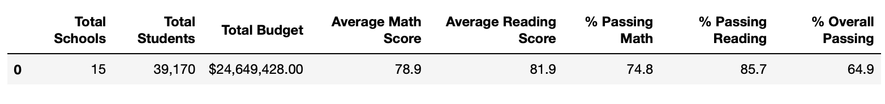
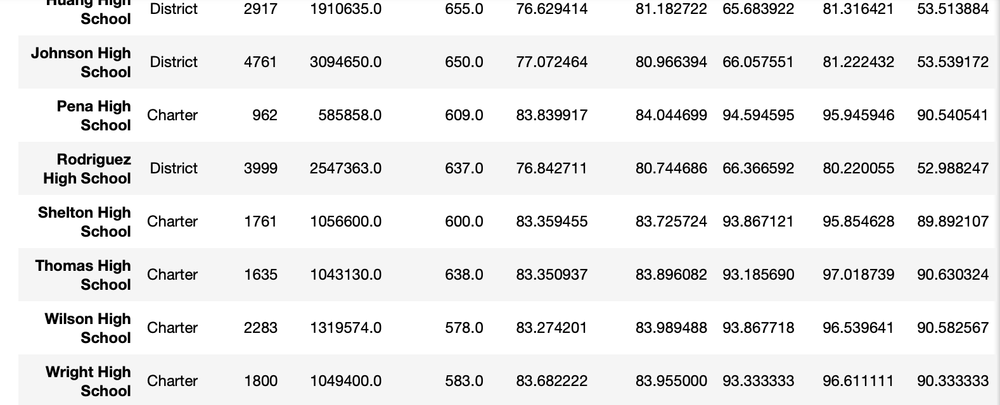

# School_District_Analysis
Analysis of the performances of students in schools located in each districts.
The scope of this analysis involves:
- Replacing ninth grade reading and math score at Thomas High School due to exam malpractices noticed.
- Analysing Thomas High School and district schools overall performance without Thomas ninth grade scores.
- Provide a written report for the school district analysis
The purpose is to see the effect of removing Thomas High School ninth grade score on other schools' analysis and district's analysis.
#### Resources
students_complete.csv
schools_complete.csv
pandas would be used for this analysis.
## Results
##### Effect on district summary

After removing Thomas High School ninth grade scores:
- district overall percentage reduced from 65% to 64.9% 
- district Math passing percentage also fell from 75% to 74.9%
- district Reading passing percentage droppd by 0.3%. 

##### Effect on school summary
Removing Thomas High School ninth grade scores has no significant impact on other schools in the districts.
However, the following impacts can be seen on Thomas High School summary
- Math Passing rate raised from 66.91% to 93.2%
- Reading passing rate also raised by 27.3%
- while the overall passing rate increased by 25.6% relative to other schools
##### Other effects
- Math and reading scores by grade
  No significant impact except for Thomas High School ninth grade with NaN 
- Scores by school spending
  No significant imopact
- Scores by school size
  No significant impact
_ Scores by school type.
  No significant impact 

## Summary
Removing theb scores of Thomas High School ninth grade had significant impact on Thomas High School overall performance and little impact
on the district performance. But it has no effect on scores by school spending, school size, and school type.
#### Recommendation
If an academic dishonesty is detected at any school results, instead of cancelling the whole district's result, it would be effective to eliminate the grade where the dishonesty is observed. 

